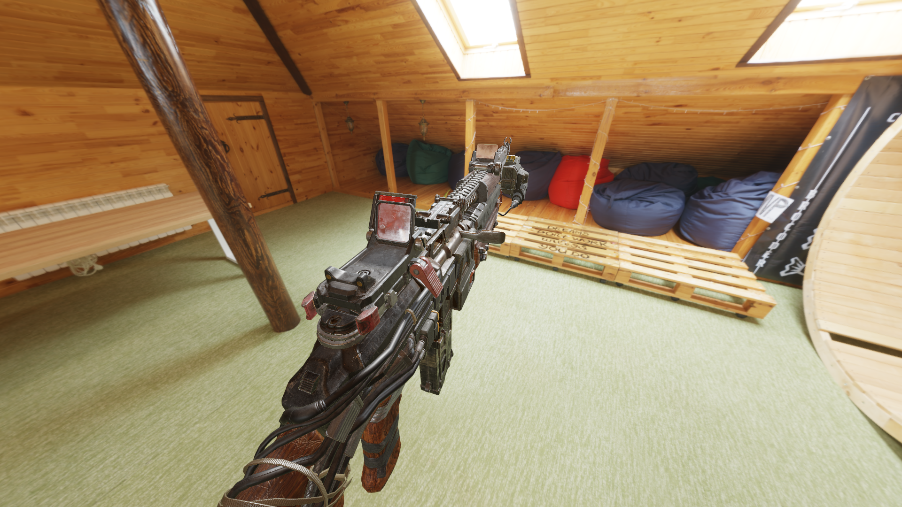

# RenderLoo

This is my OpenGL realtime rendering lab based on [loo](https://github.com/Hyiker/loo), in which I can test my ideas.

## Features

- [x] Rendering pipeline
  - [x] Deferred shading
  - [ ] Forward+(under construction)
- [x] Physically based rendering
  - [x] Metallic-roughness workflow
  - [x] IBL
- [x] Camera
  - [x] Perspective
    - [x] Arcball
    - [x] FPS
- [x] Transparency(2-pass method, alpha test+alpha blend)
- [x] Shadow
  - [x] Main light PCF

## Gallery

Gun with correct transparency and shadow
